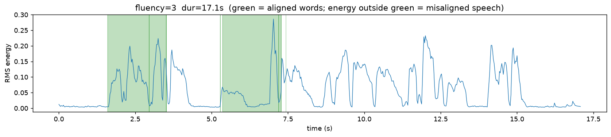
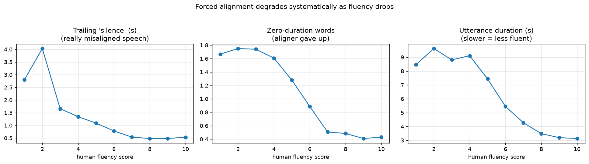
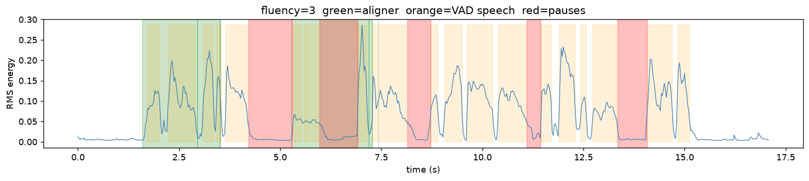
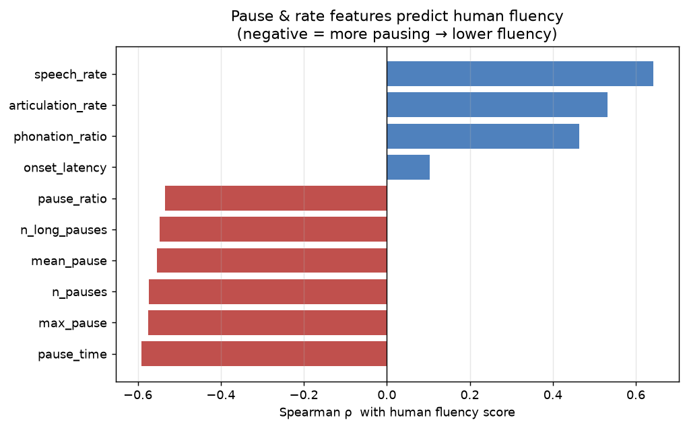
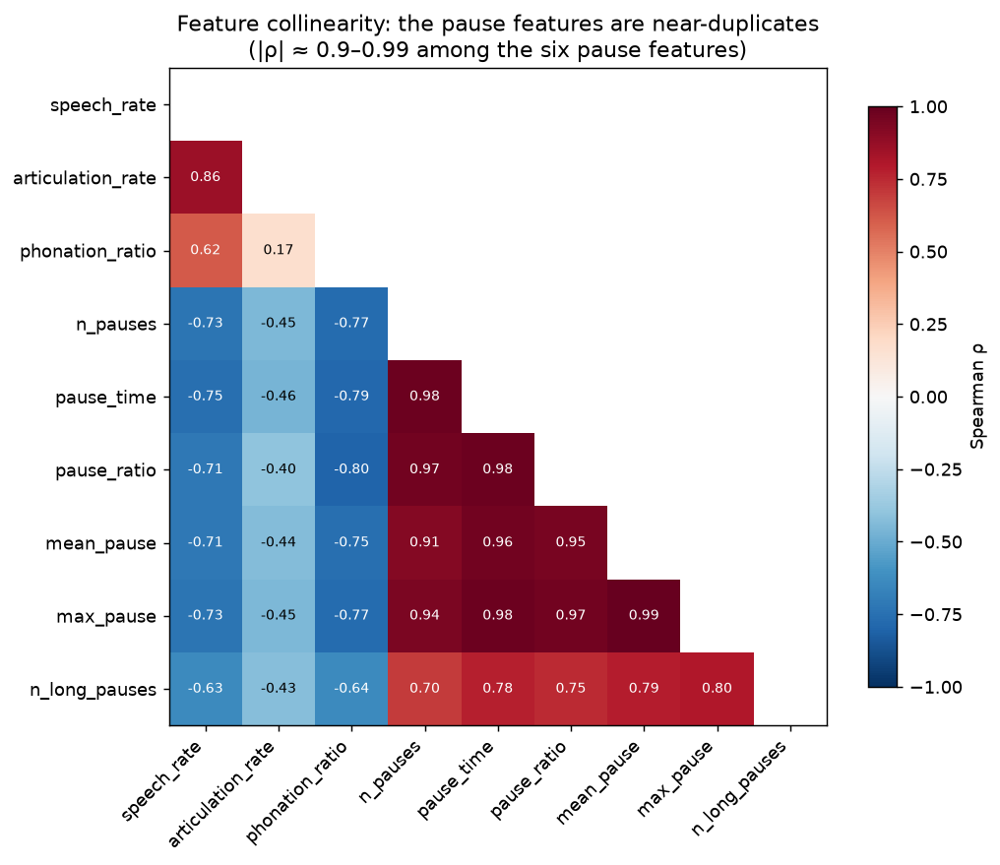

# fluency-from-alignment
### Predicting Spoken Fluency from Pause Structure with Forced Alignment + VAD

An end-to-end pipeline that predicts human fluency ratings of spoken English from the
timing and pause structure of the audio, using Qwen3 forced alignment and energy-based
voice activity detection, validated against expert scores.

---

## The Problem

When someone reads a passage aloud, how do we automatically judge how *fluently* they
read it — smoothly and without unnecessary pauses — the way a human rater would?

This is a core task in automated scoring of spoken assessments. The challenge is that
fluency lives in the *timing* of speech: where the pauses fall, how long they last, how
fast the words come. This project extracts that timing structure from audio and models
it against expert human fluency scores.

**The key insight:** the human fluency label in speechocean762 is defined as speaking
*smoothly and without unnecessary pauses*. That means pause structure — measured directly
from the audio — is a directly interpretable signal for the human judgment, without needing
to recognize *what* was said.

---

## Approach

1. **Forced alignment** (Qwen3-ForcedAligner-0.6B) → word-level timestamps, used where
   speech aligns cleanly.
2. **Pause & timing features** from energy-based VAD: speech/articulation rate, phonation
   ratio, pause counts and durations, onset latency, long-pause count.
3. **Modeling & interpretation** — Spearman validation, an interpretable model, and a
   collinearity analysis (heatmap + Lasso stability) to find which features carry unique signal.

---

## Key Design Decisions

| Decision | Choice | Rationale |
|----------|--------|-----------|
| Alignment vs ASR | Forced alignment (text known) | Read-aloud task — reference text is known, so skip ASR and its transcription errors |
| Pause measurement | Energy-based VAD, not alignment timestamps | Forced alignment breaks on disfluent speech; VAD is text-independent and stays robust |
| Fluency target | Continuous 0–10, Spearman validation | Labels are heavily skewed (~82% score 7–10); accuracy would reward a "predict high" baseline |
| Edge silence | Trimmed before rate/ratio features | Leading/trailing silence depends on when *record* was pressed — a recording artifact, not fluency |
| Word counts for rates | From known reference text, not the aligner | Text is known, so word count is reliable even where alignment fails |
| Feature selection | Group by collinearity block, keep interpretable representative | No linear model resolves interpretation under severe collinearity; domain judgment does |

---

## Why not just use the alignment timestamps?

Forced alignment assumes the audio contains exactly the reference words, in order. This
holds for fluent readers but breaks on disfluent speech — precisely the low-fluency tail
we most care about.

We verified this empirically. On a disfluent utterance (human fluency = 3), the aligner
piled the reference words into the first half of the audio and left the entire second half
unmapped (reported as "trailing silence"). An energy plot revealed that region was not
silence at all — it was speech the aligner failed to place:



The failure is systematic, not incidental. Measured across all 2,500 training utterances,
every alignment-failure signal — trailing "silence", zero-duration words, and utterance
duration — falls monotonically as human fluency rises:



So we measure pauses directly from the audio using **energy-based Voice Activity Detection
(VAD)** — a technique that labels each short frame of audio as speech or silence based on
its energy (loudness), without needing to know what words were spoken. We split the audio
into 25 ms frames, compute each frame's RMS energy, and threshold it (adaptively, per
utterance) into speech vs. silence. Silence stretches longer than 250 ms between speech
count as pauses.

Because VAD looks only at the audio signal and not at any reference text, it stays reliable
on disfluent speech — it recovers the speech the aligner missed and detects the real pauses
(red) regardless of what was said:



---

## Results

### The features predict human fluency

All timing features correlate with human fluency in the expected direction across 2,500
utterances — rate features positive, pause features negative — and all are highly significant:



`speech_rate` (words per second) is the single strongest predictor (ρ = 0.64). Pause
features cluster between ρ = −0.53 and −0.59; onset latency barely matters (ρ = 0.10).

### But nine features are really about three things

The features are highly collinear — the six pause features are near-duplicates of one
another (ρ up to 0.99):



This breaks per-feature importance from a linear model: with correlated inputs, Ridge
*spreads* weight across them, so SHAP importances get scattered arbitrarily. Collinearity
this severe has to be handled before modeling, with domain judgment — so we group the nine
features into ~3 independent blocks (speed, pausing, phonation) and keep one interpretable
representative of each: `speech_rate`, `n_pauses`, `phonation_ratio`.

Two independent checks validate this:
- **A 3-feature model matches the 9-feature one** (test ρ = 0.627 vs 0.630), confirming the
  other six added only redundancy.
- **Lasso, run across 50 bootstrap resamples, converges on `n_pauses`** (49/50) as the pause
  representative — the same feature we picked by hand, chosen independently.

### The simplest feature wins — and that matters

`speech_rate` alone reaches test ρ = 0.621 — within 0.009 of the full nine-feature model.
Speech rate is repeatedly the strongest, most robust fluency signal across speech-scoring
domains, and it has a decisive practical advantage: non-technical stakeholders understand it.
In educational and clinical settings, a score that affects a student or patient has to be
*defensible* — "read at 3 words/sec" is transparent and trusted; a black-box combination of
features is neither. The right engineering choice is often the interpretable feature people
can reason about, not the marginally-better complex one.

| Model | Features | Test Spearman ρ |
|-------|----------|-----------------|
| Full | 9 timing features | 0.630 |
| Reduced | 3 (one per block) | 0.627 |
| Single feature | speech_rate only | 0.621 |

---

## Notebooks

- `01_explore_data.ipynb` — dataset exploration + fluency target distribution
- `02_forced_alignment.ipynb` — forced alignment + the case for VAD
- `03_features.ipynb` — VAD-based fluency features + Spearman correlations
- `04_model_shap.ipynb` — interpretable model, collinearity analysis, feature reduction

---

## Data

[speechocean762](https://huggingface.co/datasets/mispeech/speechocean762) — 5,000 English
utterances from 250 non-native speakers (adults and children), Apache-2.0. Each utterance
scored by 5 experts at utterance / word / phoneme level (accuracy, fluency, completeness,
prosody). Audio ships at 16 kHz. Also carries speaker, gender, and age.

**Note:** Data not tracked in git; downloaded via HuggingFace `datasets`.

---

## Setup

```bash
git clone https://github.com/KelyNorel/fluency-from-alignment.git
cd fluency-from-alignment
pyenv activate fluency-from-alignment
pip install -r requirements.txt

# The forced aligner is very new; if the model type isn't recognized,
# install transformers from source:
pip install "git+https://github.com/huggingface/transformers"

# speechocean762 downloads automatically via HuggingFace datasets on first run
```

---

## Stack

- **Qwen3-ForcedAligner-0.6B** — word-level forced alignment (via native Transformers support)
- **HuggingFace Transformers / datasets** — model loading, inference, speechocean762
- **PyTorch + MPS** — inference on Apple Silicon
- **NumPy** — energy-based Voice Activity Detection (VAD) and pause detection
- **scikit-learn** — Ridge / Lasso models and feature analysis
- **SHAP** — feature attribution
- **scipy, matplotlib** — statistics and visualization
- **Python 3.11**

---

## Limitations

- **Alignment on disfluent speech:** Forced alignment is unreliable in the low-fluency tail (documented above); pause features come from VAD instead.
- **Short utterances:** speechocean762 utterances are a few seconds each, so per-utterance pause counts are low; signal comes from aggregating across thousands of utterances.
- **Non-native, scripted speech:** The corpus is native-Mandarin speakers reading fixed prompts. Findings may not transfer directly to spontaneous speech or other L1 backgrounds.
- **Label skew:** Very few low-fluency examples (~5% score ≤ 4), which limits how finely the model can learn the disfluent end of the scale.

---

## Project Structure
```
fluency-from-alignment/

├── notebooks/

│   ├── 01_explore_data.ipynb         # dataset exploration + fluency target distribution

│   ├── 02_forced_alignment.ipynb     # forced alignment + the case for VAD

│   ├── 03_features.ipynb             # VAD-based fluency features + correlations

│   └── 04_model_shap.ipynb           # model, collinearity analysis, feature reduction

├── figures/                          # committed plots used in this README

├── data/                             # not tracked in git (dataset cache, feature parquets)

├── requirements.txt

└── README.md
```
---

**Author:** Raquel (Kely) Norel, PhD  
**Domain:** Speech Processing / Educational Measurement / NLP  
**Status:** ✅ Analysis complete — timing features predict human fluency (test ρ = 0.63); speech rate alone captures nearly all the signal
